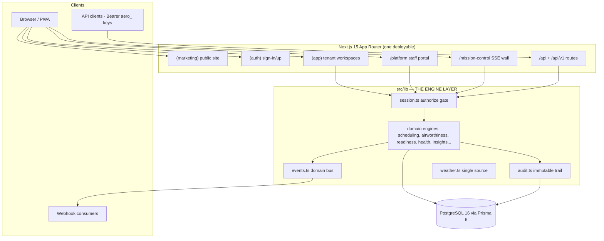
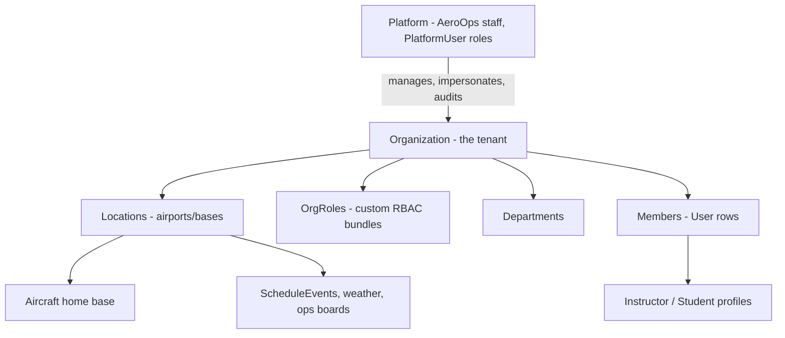
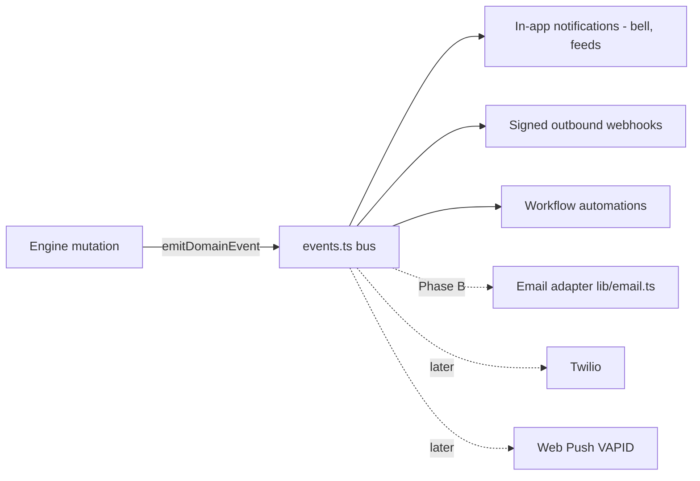

# AeroOps System Architecture

**The source of truth for how AeroOps is built.** Every future
implementation must comply with this document; deviations require an ADR in
[DECISIONS.md](./DECISIONS.md) *before* the code lands. Companions:
[CONSTITUTION.md](../../CONSTITUTION.md) (enforced rules),
[API_STANDARDS.md](./API_STANDARDS.md),
[DATABASE_STANDARDS.md](./DATABASE_STANDARDS.md),
[SECURITY_STANDARDS.md](./SECURITY_STANDARDS.md),
[PRODUCTION.md](../../PRODUCTION.md) (launch plan).

## 1. Overall system architecture

AeroOps is a single Next.js 15 (App Router) application backed by PostgreSQL
via Prisma 6 (pinned). One codebase serves five surfaces — public marketing
site, auth, the tenant application, the internal platform portal, and
Mission Control — plus a versioned REST API. This is a deliberate
stage-appropriate choice: the internal boundaries below are the future
monorepo package seams, and nothing crosses them except through exported
functions.



## 2. Frontend architecture

- **Server components by default.** Pages fetch through engine functions on
  the server; client components exist only where interactivity demands
  (`"use client"` is a deliberate boundary, not a habit).
- **Route groups as surfaces**: `(marketing)` and `(app)` have separate
  layouts, headers, and design contexts — no org data ever renders on a
  marketing page (do-not-break rule 8).
- **Design system only**: primitives in `src/components/ui`, shell in
  `src/components/shell`, brand marks in `src/components/brand/logo.tsx`.
  Colors come from tokens in `src/app/globals.css`; status colors exclusively
  from `src/lib/status-colors.ts` (one `STATUS_TONE` map, meanings frozen,
  machine-tested).
- **State**: server state lives on the server; client state is local
  `useState`/`useReducer` plus URL params. There is no global client store —
  adding one requires an ADR.
- **Responsive contract**: every page works desktop/tablet/mobile (bottom
  nav below `lg`), light + dark, keyboard-reachable, reduced-motion honored,
  and prints acceptably where public-facing (`@media print` block in
  `globals.css`).

## 3. Backend architecture

Business logic lives in `src/lib` engines; routes and pages stay thin. A
route does exactly five things, in order:

```
validate (zod) → authorize() → call engine → recordAudit → emitDomainEvent
```

Engines are **explainable**: anything computed — scheduling conflicts,
airworthiness, checkride readiness, fleet health (0–100), org health,
insights, forecasts — returns its reasons (factors/basis/confidence)
alongside its answer. A number without a "why" is a bug, and contract tests
pin it (fleet-health factors must sum to the score).

| Engine | File | Answers |
|---|---|---|
| Scheduling conflicts | `lib/scheduling.ts` | can this booking exist; if not, why + alternatives |
| Airworthiness | `lib/airworthiness.ts` | can this aircraft fly (enforced at dispatch release) |
| Work orders | `lib/work-orders.ts` | which maintenance transitions are legal |
| Fleet / org health | `lib/fleet-health.ts`, `lib/health-score.ts` | 0–100, factor by factor |
| Checkride readiness | `lib/readiness.ts` | is this student ready, factor by factor |
| Insights / forecast | `lib/insights.ts`, `lib/forecast.ts` | recommendations + tomorrow's load, with confidence |
| Automations | `lib/automations.ts` | org-toggleable reactions to domain events |
| Import | `lib/import/` | spec-driven migration with dry-run + rollback manifests |
| Demo / simulation / snapshot | `lib/demo-generator.ts`, `lib/simulation.ts`, `lib/org-snapshot.ts` | founder-platform tenant tooling |

## 4. API architecture

REST under `app/api/`; the public surface is `/api/v1/*`, a rewrite of the
same handlers (`next.config.ts`) — a breaking change forks a real `v2`
implementation rather than mutating `v1`. Authentication is session cookie
or `Bearer aero_…` API key (sha256-hashed at rest, permission-scoped).
Outbound webhooks are HMAC-SHA256 signed with per-attempt delivery records.
Full conventions: [API_STANDARDS.md](./API_STANDARDS.md).

## 5. Authentication architecture

NextAuth v5 (JWT strategy) with credentials + TOTP MFA challenge and
env-gated Google/Microsoft SSO seams. Passwords: 12-char minimum + breach
list (`lib/password.ts`). `sessionVersion` on the user row enables
revoke-everywhere. Three session kinds resolve through one helper
(`getSession()` in `lib/session.ts` — never `auth()` directly):

| Kind | Identity table | Surface |
|---|---|---|
| `org` | `User` (organizationId set) | `(app)` tenant workspaces |
| `individual` | `User` (organizationId null) | `/welcome` onboarding only |
| `platform` | `PlatformUser` (separate table, separate roles) | `/platform` |

Impersonation (platform staff → tenant) is an HMAC-signed, expiring cookie;
read-only by default with mutation blocking; start/stop audited and
customer-notified. Email verification and password reset land in Phase B of
[PRODUCTION.md](../../PRODUCTION.md) §13.1.

## 6. Authorization model

One gate: `authorize(permission, {mutating})` / `authorizePlatform(roles)`
in `lib/session.ts`. It resolves the session, scopes to the organization,
checks suspension, permission, module gating (business profiles), and
read-only impersonation — no route checks permissions by hand, and
`tests/constitution.test.ts` fails the build if one tries. RBAC is **data**:
`lib/permissions.ts` is the catalog; role bundles and custom org roles
reference it; UI, server pages, and APIs all gate from the same
`session.permissions` set; every nav item maps to `SECTION_PERMISSIONS`
(tested). Exactly two exception categories exist, each allowlisted with a
written reason in the test: public-by-design routes and self-service
identity routes.

## 7. Organization hierarchy



The **active location** is a per-user cookie (`aerops-location`) falling
back to the org's first active location; anything location-sensitive
(weather, ops boards, filters) must respect it. Business profiles
(`lib/business-profiles.ts`) — flight school, club, rental, FBO,
maintenance, corporate — drive module enablement per org.

## 8. Multi-tenancy model

Shared schema, row-scoped: every operational record hangs off
`Organization` via `organizationId` with scoped indexes. **Org scope comes
from the session, never from client input** — cross-tenant queries exist
only on platform-admin routes behind `authorizePlatform`. Isolation is
enforced in the engine layer (not DB RLS — an ADR documents why), verified
by cross-tenant denial tests against the running app. Tenant lifecycle
tooling (demo generation, snapshots, simulation) lives behind the platform
surface and is FK-order-aware (`lib/org-snapshot.ts` is the canonical wipe
order).

## 9. Weather architecture

Single source: `src/lib/weather.ts` (`airportWeather`,
`activeLocationWeather`, `weatherSummary`, `icaoOf`), keyed to the active
org + active location. The generator is a deterministic simulated METAR
(seeded by ICAO + hour); the production METAR/TAF adapter replaces its
internals without touching any consumer. **No airport identifier or
METAR-style string may be hardcoded in UI code** — `tests/weather.test.ts`
statically scans for violations and the suite fails if one appears
(mutation-tested during the 2026-07-07 audit).

## 10. Scheduling architecture

`lib/scheduling.ts` owns booking legality: aircraft-timeline conflict
detection (double-booking, maintenance overlap, grounded aircraft,
instructor availability) with alternative-slot suggestions, lesson
requests, and waitlists. Dispatch (`Dispatch` model + dispatch routes) is
the operational lifecycle: pre-flight release checklist (airworthiness
enforced — a grounded aircraft cannot be released) → post-flight closeout
capturing Hobbs/Tach → meters, ledgers, and invoice updated **in one
`db.$transaction`** (do-not-break rule 5). Aviation-domain conventions:
[../aviation/AVIATION_STANDARDS.md](../aviation/AVIATION_STANDARDS.md).

## 11. Notification architecture

Layered on the domain event bus (`lib/events.ts`):



Producers emit once; adding a consumer never touches domain code.
Subscriber failures are isolated — they can never affect the operation that
emitted. `emitWebhook` is callable only inside `src/lib`
(constitution-tested). The bus is in-process today; a durable queue slots in
behind `emitDomainEvent` without changing any call site. Mission Control
real-time uses SSE (`/api/mission-control/stream`) fed by one snapshot
builder (`lib/mission-control.ts`) — no widget polls independently, and
snapshot sections are permission/module-gated server-side.

## 12. File storage architecture

Documents are **metadata-only today** (`Document` model). Production design
(PRODUCTION.md §2): Cloudflare R2, bucket-per-purpose
(`aerops-documents` private + signed URLs, `aerops-public` marketing),
org-id key prefixes, presigned upload/download so file bytes never transit
the app server, object versioning + lifecycle rules. Until R2 lands, no
code may accept raw file uploads except the Import Center's bounded
parse-only path (5 MB / 5 000 rows / 100 cols, `lib/import/parse.ts`, files
never persisted).

## 13. Billing architecture

Two distinct money systems — do not conflate them:

1. **Tenant operations billing** (live today): org-scoped invoices, payment
   records, receivables aging (`lib/billing.ts`), auto-generated from
   dispatch closeout inside the closeout transaction. Money is `Decimal`,
   never float.
2. **AeroOps subscription billing** (Phase C, planned): plan catalog is DB
   rows (`SubscriptionPlan`); Stripe hosted Checkout + Customer Portal;
   signature-verified webhook with `BillingEvent` idempotency;
   `BILLING_ENFORCEMENT` env flag (`off|warn|enforce`) as the rollback
   lever. Card data never touches AeroOps. Details: PRODUCTION.md §13.2.

## 14. Infrastructure architecture

Target production shape (planned, not provisioned — PRODUCTION.md §1):
Vercel (app) · Neon Postgres (PITR + branch-per-preview) · Upstash Redis
(rate limits/cache) · Inngest (queue) · Cloudflare (DNS/CDN/WAF) + R2
(files) · Resend (email) · Stripe (billing) · Sentry + BetterStack
(observability). Every adapter plugs into an existing seam behind an env
flag and degrades gracefully when unset. Self-host alternative: one Docker
image + Postgres + Redis, same env contract.

## 15. Security boundaries

```mermaid
flowchart TD
    subgraph Public["Public (no session)"]
        MK[marketing pages] --- PF[public forms: demo, join, invite accept] --- HL[/api/health/]
    end
    subgraph Individual["individual session"]
        WEL[/welcome onboarding only/]
    end
    subgraph Tenant["org session — organizationId from session"]
        TA[(app) workspaces + org APIs]
    end
    subgraph Staff["platform session — separate identity"]
        PP[/platform portal + cross-tenant admin/]
    end
    Public -->|sign-up| Individual -->|join/create org| Tenant
    Staff -->|impersonation: signed cookie, read-only default, audited| Tenant
```

Boundary rules: marketing never sees org data; individual sessions reach
`/welcome` only; org sessions never cross tenants; platform staff cross
tenants only through audited, catalogued routes; the AI layer **never
mutates** (dispatch, maintenance approval, payments, deletion always
require a human through permissioned APIs). Full standards:
[SECURITY_STANDARDS.md](./SECURITY_STANDARDS.md).

## 16. Data flow

Canonical write path (dispatch closeout, the reference implementation):

```
UI action → POST /api/dispatch/.../closeout
  → zod validation
  → authorize("dispatch.manage", {mutating: true})   ← session, org scope, impersonation check
  → engine: one db.$transaction { meters + ledger + invoice }
  → recordAudit(actor, org, action, metadata, IP/UA)
  → emitDomainEvent(orgId, "flight.closed", …)       ← webhooks/automations/notifications fan out
  → response with the engine's explained result
```

Read paths mirror it without the last three steps. Computed values
(airworthiness, health, readiness) are **derived at read time, never stored
and re-synced**.

## 17. Error handling philosophy

- User-facing errors are **actionable** — they say what to do next, not
  what went wrong internally.
- Nothing fails silently: batch operations report per-row outcomes (the
  Import Center — row numbers, reasons, downloadable failed rows — is the
  reference pattern).
- Engines throw typed/sentinel errors; routes translate them to the standard
  error shape ([API_STANDARDS.md](./API_STANDARDS.md)); unexpected errors log
  through `lib/logger.ts` (→ Sentry in Phase D) without leaking internals.
- Subscriber/side-effect failures (webhooks, notifications) are isolated
  from the primary operation, logged, and visible (per-attempt delivery
  records in Settings → Developers).

## 18. Scalability strategy

Order of operations when load arrives (PRODUCTION.md §9.54): (1) Redis
cache for dashboards/Mission Control snapshots, (2) dedicated SSE/fan-out
channel past ~500 concurrent walls, (3) Postgres read replica for
reports/executive, (4) nightly rollup tables for platform analytics. The
seams already exist: in-process bus → durable queue behind
`emitDomainEvent`; in-memory rate limiter → Redis behind the same
interface; monolith → monorepo packages along the `lib/` engine boundaries.
Scale by sliding provider tiers, not re-architecting.

## 19. Future extensibility guidelines

1. **Extend existing modules and idioms** — never invent a parallel
   abstraction for something an engine already answers.
2. **New capability = new engine in `lib/` + contract test**, exposed
   through thin routes/pages; explainability is part of the contract.
3. **New integration = adapter behind an env flag**, no-op/degraded when
   unset (email, Stripe, METAR, R2, Sentry all follow this pattern).
4. **New consumer of domain activity = event-bus subscriber**, never a hook
   inside domain code.
5. **Schema changes are additive within a release**; destructive cleanup
   ships one release after the code that stops using it.
6. **Changing a pattern in this document requires an ADR first**
   ([DECISIONS.md](./DECISIONS.md)) and a same-PR update here.

## Related documents

[DECISIONS.md](./DECISIONS.md) ·
[API_STANDARDS.md](./API_STANDARDS.md) ·
[DATABASE_STANDARDS.md](./DATABASE_STANDARDS.md) ·
[SECURITY_STANDARDS.md](./SECURITY_STANDARDS.md) ·
[../engineering/ENGINEERING_HANDBOOK.md](../engineering/ENGINEERING_HANDBOOK.md) ·
[../engineering/AI_REVIEW_BOARD.md](../engineering/AI_REVIEW_BOARD.md) ·
[../aviation/AVIATION_STANDARDS.md](../aviation/AVIATION_STANDARDS.md) ·
[../../CONSTITUTION.md](../../CONSTITUTION.md) ·
[../../PRODUCTION.md](../../PRODUCTION.md)
