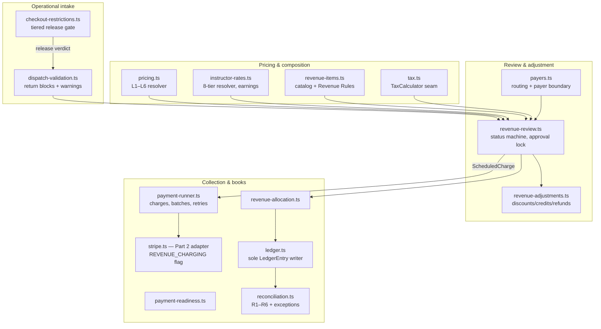

# Revenue Engine Architecture

> **Status:** Proposed — Phase 8 Part 1 · **Date:** 2026-07-10 · **Lead roles:** Principal Software Architect at Stripe; Head of Software Engineering at Meta; Security Engineer at Cloudflare; Reliability/SRE Engineer · **Part of:** Revenue Engine design set ([README](./README.md))

This is Deliverable 2 of the Phase 8 Part 1 design set and the **entry point** to the Revenue Engine design. It is the executive read: every architectural topic required by spec Part M gets a section here (1–3 paragraphs) with a pointer to the detailed design doc that binds it. It complies with, and extends, [ARCHITECTURE.md](../ARCHITECTURE.md) — nothing in this design changes an existing pattern without a superseding ADR (recorded in [15-adr-proposals.md](./15-adr-proposals.md)).

**Part 1 is design only.** Nothing was deployed; no live payments were enabled; no source code, schema, or migration changed. Part 2 implements against Stripe **test mode only**, behind env flags that default off, and may not begin live-payment work until this architecture and the full threat model (Part 2 entry gate, §17) are approved.

**What the Revenue Engine is.** The aviation-native financial workflow that begins when an aircraft is dispatched and ends when the customer is charged, the school receives its proceeds, AeroOps earns its platform fee, Instructor Compensation is recorded, the books reconcile, and Revenue Reports and Financial Exports update. Customer-facing concepts use Revenue Engine vocabulary (Revenue Dashboard, Revenue Review, Revenue Item, Aircraft Pricing Profile, Instructor Rate Profile, Revenue Rule, Payment Method, Payment Attempt, Revenue Allocation, Instructor Compensation, Financial Export, Revenue Report); backend records keep standard accounting and provider terms (Invoice, InvoiceLine, PaymentIntent, PaymentTransaction, Refund, TaxSnapshot, LedgerEntry, Dispute). Existing DB concepts are never renamed for marketing reasons.

---

## 1. The design set

| Doc | Owns |
|---|---|
| [00-current-billing-audit.md](./00-current-billing-audit.md) | Current-state audit: the live Dispatch→Invoice spine, model inventory, gap table, confirmation no payment provider exists |
| **01 (this doc)** | Architecture: boundaries, module map, end-to-end workflow, idempotency, isolation, failure handling, threat-model summary; the Revenue Rule Part 1 position (§7.1) |
| [02-operational-dispatch-and-closeout.md](./02-operational-dispatch-and-closeout.md) | Aircraft checkout (dispatch prepare + release) and return/closeout; validation matrix; the evolved closeout transaction |
| [03-revenue-review-lifecycle.md](./03-revenue-review-lifecycle.md) | Revenue Review anatomy, 16-status machine, approval sequence and policies, immutable approval snapshot |
| [04-instructor-time-and-rates.md](./04-instructor-time-and-rates.md) | Instructor time entry; Instructor Rate Profiles (billing vs compensation); InstructorEarning snapshots |
| [05-aircraft-pricing-profiles.md](./05-aircraft-pricing-profiles.md) | Aircraft Pricing Profiles: versioning, eligibility selectors, the L1–L6 deterministic resolver |
| [06-revenue-items.md](./06-revenue-items.md) | Revenue Item catalog (26 built-ins + custom), line origins, manual-item controls, HIGH-risk floor |
| [07-tax-model.md](./07-tax-model.md) | Org/location TaxRule versions, taxability resolution, TaxSnapshot at approval, TaxCalculator adapter seam |
| [08-adjustments-discounts-credits.md](./08-adjustments-discounts-credits.md) | RevenueAdjustment (all eight Part H operations), refunds, bounded credits, promo codes |
| [09-payment-timing-and-collection.md](./09-payment-timing-and-collection.md) | Payment timing policies, ScheduledCharge/PaymentAttempt machines, Payment Methods, webhook idempotency, batch runner |
| [10-checkout-restrictions.md](./10-checkout-restrictions.md) | Checkout-restriction matrix: SAFETY / OPERATIONAL / FINANCIAL tiers on the existing release gate |
| [11-responsible-payers.md](./11-responsible-payers.md) | ResponsiblePayer + StudentPayerRelationship, charge routing, payer self-service boundary |
| [12-revenue-allocation-and-reporting.md](./12-revenue-allocation-and-reporting.md) | RevenueAllocation, PlatformFee, LedgerEntry, reconciliation, Revenue Dashboard/Reports, Financial Export seam |
| [13-database-model.md](./13-database-model.md) | **Canonical and binding** schema: Part L audit table, money/currency decision, all models, enums, FK actions, uniqueness inventory |
| [14-migration-plan.md](./14-migration-plan.md) | Additive migration sequencing, backfills, fixture validation |
| [15-adr-proposals.md](./15-adr-proposals.md) | ADR proposals (headline: ADR-025 superseding ADR-011's invoice clause) |

Where any doc and [13-database-model.md](./13-database-model.md) disagree on a name, type, constraint, or FK action, 13 wins.

## 2. Component and module map

New capability = new engine in `src/lib` + contract test, exposed through thin routes (ARCHITECTURE.md §19). Engines are pure and explainable — every computed price, tax, restriction verdict, and payer resolution returns its reasons. New engines are flat files in `src/lib`, matching house style (`scheduling.ts`, `airworthiness.ts`); no new directory idiom is introduced.

| Engine (proposed file) | Answers | Bound by |
|---|---|---|
| `src/lib/dispatch-validation.ts` | Can this return/closeout proceed — 11 hard blocks, 9 configurable warnings, with reasons | 02 |
| `src/lib/checkout-restrictions.ts` | Can this dispatch release — SAFETY/OPERATIONAL/FINANCIAL findings, override/review paths | 10 |
| `src/lib/pricing.ts` | Which Aircraft Pricing Profile applies and what the rental line costs (L1–L6, ambiguity warnings, full trace) | 05 |
| `src/lib/instructor-rates.ts` | Billing and compensation rates per time category (8-tier resolver); InstructorEarning math | 04 |
| `src/lib/revenue-items.ts` | Revenue Item catalog, availability scoping, Revenue Rule auto-application (Part 2 seam — §7.1), manual-item controls | 06 |
| `src/lib/tax.ts` | Taxability per line, stacked rule computation, TaxSnapshot content; `TaxCalculator` adapter seam | 07 |
| `src/lib/revenue-review.ts` | Legal review transitions, approval preconditions, the immutable snapshot write | 03 |
| `src/lib/revenue-adjustments.ts` | The eight adjustment operations, approval/application claims, credit and promo consumption | 08 |
| `src/lib/payers.ts` | Payer resolution (explicit → default → self-pay, with basis), relationship capabilities | 11 |
| `src/lib/payment-readiness.ts` | Is this review chargeable — payer present, Payment Method on file, policy compatibility | 09 |
| `src/lib/payment-runner.ts` | Claim due ScheduledCharges, create PaymentAttempts, apply results; three triggers, no queue required | 09 |
| `src/lib/stripe.ts` *(Part 2)* | Provider adapter behind `REVENUE_CHARGING` (`createCustomer`, `createSetupSession`, `detachPaymentMethod`, `createCharge`, `parseWebhookEvent`) | 09 |
| `src/lib/revenue-allocation.ts` | Balanced REVENUE/PROCEEDS allocation sets per financial event; PlatformFee accrual | 12 |
| `src/lib/ledger.ts` | The only writer of append-only double-entry LedgerEntry journals; posting matrix | 12 |
| `src/lib/reconciliation.ts` | Invariants R1–R6, staleness watches, ReconciliationException lifecycle; Part 2 payout matching | 12 |

`src/lib/billing.ts` remains for legacy invoice math and receivables aging; its live-rate recomputation paths are superseded on the review path (docs 04, 12). `src/lib/session.ts` gains `authorizePayer()` (§16).

**API route groups** (thin: `authorize → zod → engine → recordAudit → emitDomainEvent`): `/api/dispatch` (create, `[id]/release`, `[id]/close`, `[id]/restrictions`); `/api/revenue/*` (reviews and transitions, pricing profiles, instructor rates, items, taxes, adjustments, credits, promo codes, allocations/reports, `payment-runs`); `/api/organization/*` settings routes for the four config singletons (DispatchPolicy, RevenueWorkflowPolicy, OrgPaymentPolicy, RevenueSettings) and `checkout-restrictions`; `/api/payer/*` (payer self-service, gated by `authorizePayer()`, catalogued in `SELF_SERVICE_ROUTES`); `/api/webhooks/stripe-connect` (Part 2, PUBLIC-catalogued with written reason, signature-verified, rate-limited). Exact route shapes are Part 2 work; the groups and their gates are fixed here.

**RBAC and module gating (delegated here by docs 05/06/07):** all new permission keys are data in `src/lib/permissions.ts` — `revenue.*` (reviews, pricing, rates, items, taxes, charging, compensation, reconciliation) and `dispatch.*` (warning/restriction overrides and reviews). The binding call this doc makes is module gating only: `MODULE_BY_PREFIX` gains `revenue → billing`, so every `revenue.*` key module-gates with zero wiring. Whether the adjustment/refund/promo/payer keys that docs 08/11 introduced as `billing.*` also move under `revenue.*` is the open P0 namespace decision, D3 in [16](./16-risks-and-open-decisions.md) — recommended resolution: a single `revenue.*` prefix, with the doc 08/11 renames landing in the consistency pass. This doc defers to that register rather than deciding the namespace here. No new `Role` enum values: Operations Director, Chief Flight Instructor, and Chief Pilot ship as `OrgRole` templates carrying the relevant keys. No route or engine ever checks a role name.

## 3. The defining workflow, end to end

The Mission's sequence, with every transaction boundary and asynchronous hop explicit. **[TX-n]** = one `db.$transaction`; **⇢ async** = time passes and a different actor/trigger resumes. No payment-provider call ever executes inside a database transaction.

1. **Dispatch prepared** — `POST /api/dispatch` (new route, `dispatch.release`) creates the `Dispatch` (PENDING) from the ScheduleEvent with checkout capture: aircraft, student/customer, Responsible Payer if known, instructor, Hobbs/Tach Out, fuel/oil, condition, squawk acknowledgment, route, notes ([02](./02-operational-dispatch-and-closeout.md)).
2. **Release gate** — `POST /api/dispatch/[id]/release`: `airworthinessOf()` safety floor, then the checkout-restriction evaluator (SAFETY pinned BLOCK; OPERATIONAL ≥ WARN; FINANCIAL per org policy with review/override paths) ([10](./10-checkout-restrictions.md)).
3. **[TX-1] Release claim** — guarded `updateMany` PENDING→RELEASED writes the release together with `DispatchRestrictionDecision` rows and the `restrictionSnapshot`. Post-commit: `recordAudit`, domain events. **⇢ async — the flight happens.**
4. **Aircraft return** — the return form captures Hobbs/Tach In, fuel/oil added, new squawks, airports visited, landings, fees (as Revenue Item references), condition, notes. `dispatch-validation.ts` returns blocks and warnings; pricing and instructor-rate resolution run **pure, in memory, before the transaction** — resolution failure annotates, never blocks ([02](./02-operational-dispatch-and-closeout.md), [05](./05-aircraft-pricing-profiles.md)).
5. **[TX-2] Operational closeout** (ADR-025, superseding ADR-011's invoice clause) — one atomic transaction: guarded RELEASED→CLOSED claim; aircraft meters roll; maintenance counters advance; student/instructor hours post; a **draft backend Invoice + draft Revenue Review** are created with system-suggested lines (aircraft rental with its rate trace, Hobbs-suggested instructor time awaiting confirmation, configured fees) and warning annotations. No money moves; no `Student.accountBalance` decrement; no provider calls. Post-commit: `flight.closed` (extended payload) and `revenue_review.created` emitted. **⇢ async — humans review.**
6. **Instructor pass** — instructor confirms/edits categorized time entries, adds notes, submits ([04](./04-instructor-time-and-rates.md)). Transitions use guarded status claims.
7. **Operations pass** — approver reviews charges, adds manual Revenue Item lines (reason required; HIGH-risk floor for damage fees), applies pre-approval adjustments; second/finance approvals recorded as append-only `RevenueReviewApproval` rows per `RevenueWorkflowPolicy`; separation of duties engine-enforced ([03](./03-revenue-review-lifecycle.md), [06](./06-revenue-items.md), [08](./08-adjustments-discounts-credits.md)).
8. **[TX-3] Approval lock** — the control reads exactly **"Approve Revenue Review and charge the saved payment method"** (consequence-truthful variants per timing policy). Server recomputes totals in Decimal; requires an `updatedAt` token + expected-total match (409 on stale screens); guarded claim to APPROVED. In the same transaction: Invoice totals frozen (`subtotal`/`taxTotal`/`total`/`currency`, `approvedAt`); `approvalSnapshot` written; `TaxSnapshot`(+items), `InstructorEarning`, balanced `RevenueAllocation` set, `PlatformFee` accrual, and the approval `LedgerEntry` journal appended; **`ScheduledCharge` created** with policy, `runAfter`, method, payer, amount, currency snapshotted write-once. **⇢ async — collection.**
9. **Charge execution** — post-commit (immediate policy) or when a batch sweep reaches `runAfter`: `payment-runner.ts` claims SCHEDULED→PROCESSING (guarded), creates a `PaymentAttempt` with deterministic idempotency key (`sc_<id>_a<n>`), and calls the provider adapter **outside any transaction** (Part 2; test mode; `REVENUE_CHARGING` off by default). **⇢ async — provider settles (card: seconds; ACH: ~4-business-day pending window mapped to review status ACH Pending).**
10. **[TX-4] Settlement applied** — inbound provider event hits `/api/webhooks/stripe-connect`: signature verified, unique-insert into `PaymentProviderEvent` (duplicate delivery is a no-op), then one transaction applies the result: `Payment` row (1:1 with the attempt), Invoice → PAID, review → Card Paid/Paid (or Payment Failed with failure code), collection ledger journal, PlatformFee → EARNED. Post-commit: receipt notification, `payment.succeeded`/`payment.failed`.
11. **Reconciliation** — continuous invariants R1–R6 plus staleness watches; Part 2 adds provider payout matching; anything unmatched opens a `ReconciliationException` ([12](./12-revenue-allocation-and-reporting.md)).
12. **Reports and exports** — Revenue Dashboard and Revenue Reports read **only** snapshotted allocation/ledger records; `FinancialExportJob` + `AccountingMapping` produce Financial Exports (Part 3), stamping exported earnings atomically.

A failure at any step after TX-2 leaves the operational record complete and the financial record in a well-defined, resumable state — that separation is the point (§4, §18).

## 4. Operational vs financial closeout

These are two distinct states, deliberately decoupled. **Operational closeout** happens the moment a valid aircraft return is recorded: TX-2 updates dispatch status, aircraft availability, Hobbs/Tach totals, maintenance counters, squawks, lesson records, and utilization — and creates the draft Revenue Review. It is fast, aviation-native, and **never waits on Stripe**: no provider call executes inside (or gates) the closeout transaction, and pricing-resolution failure produces an annotated draft rather than a blocked return. **Financial closeout** happens only after Revenue Review approval and payment processing: invoice and payment status, Revenue Allocations, PlatformFee, Instructor Compensation, tax records, receipts, and reports. Today's `Student.accountBalance` decrement at closeout moves to the financial side and is retired in favor of derived Amount Due (§18, principle 4).

The spec's "check-in" wording is resolved here, adopting [02](./02-operational-dispatch-and-closeout.md): AVIATION_STANDARDS bans "check-in" for aircraft operations, so every surface says **aircraft return / return closeout** (dispatcher UX: "Close out flight", with the draft review preview labeled "No one is charged at closeout"). One structural consequence binds everything downstream: the draft Revenue Review is created **inside** the closeout transaction, so there is no gap state between operational and financial record creation (§18.5).

Details: [02-operational-dispatch-and-closeout.md](./02-operational-dispatch-and-closeout.md).

## 5. Revenue Review lifecycle

A Revenue Review is the customer-facing, org-scoped workflow record wrapping **exactly one** backend draft Invoice (1:1; `Invoice`/`InvoiceLine` stay the accounting system of record; review lines *are* InvoiceLine rows on the wrapped Invoice — binding resolution R1 in [13](./13-database-model.md)). Its screen presents five sections per spec Part B — flight information, time summary, charges, payment, allocation — each field sourced and edit-gated explicitly. The status machine has 16 customer-facing statuses (Draft → Awaiting Instructor Review → Awaiting Operations Review → Changes Requested → Approved → Payment Scheduled/Processing → Card Paid/ACH Pending/Paid, plus Payment Failed, Partially Refunded, Refunded, Voided, Disputed, and a reserved Written Off with no writer in Parts 2–3). `Invoice.status` becomes a coarse projection maintained in the same transaction; legacy invoices without reviews are untouched. Payment-side statuses are written exclusively by the payment engine.

Every transition is a guarded `updateMany` claim (the dispatch-close idiom); duplicate billing is structurally impossible via a partial unique index allowing one non-VOIDED review per dispatch. Void never reopens operational records; post-approval void is allowed only while no Payment Attempt succeeded or is in flight; collected money exits only through refunds; un-approve does not exist.

Details: [03-revenue-review-lifecycle.md](./03-revenue-review-lifecycle.md).

## 6. Aircraft pricing resolution

One model — Aircraft Pricing Profile — expresses the whole Part D taxonomy (owner/member/student/university/wet/dry/program/location/custom) through conjunctive eligibility selectors on org-scoped, versioned, effective-dated, approval-gated rows. Approved versions are immutable; edits create the next DRAFT version, and approving v(n+1) end-dates v(n) atomically. Resolution is deterministic, exactly the spec's priority: **L1** explicit selection on the dispatch → **L2** program → **L3** membership → **L4** location → **L5** organization default → **L6** aircraft default, where L6 includes a virtual legacy profile synthesized from `Aircraft.hourlyRateWet/Dry` so a zero-config org bills exactly as today. `effectiveAt` is `Dispatch.releasedAt`: the rate posted when the customer took the aircraft governs.

Same-priority ties are never guessed silently: a deterministic tiebreak picks a candidate *and* raises an `AMBIGUOUS_RATE` warning that blocks review approval (never operational closeout) until an explicit, audited selection. The resolved rate and the full resolution trace (candidates, reasons) snapshot onto the review; approved reviews never re-resolve.

Details: [05-aircraft-pricing-profiles.md](./05-aircraft-pricing-profiles.md).

## 7. Instructor billing vs compensation

What the customer is charged and what the instructor earns are **structurally separate** (spec principle 6): one `InstructorRateProfile` model with a `kind = BILLING | COMPENSATION` discriminator — separate rows, separate versions, RBAC as a row filter — resolved through an 8-tier deterministic resolver parallel to aircraft pricing, ending in the legacy `Instructor.hourlyRate` fallback (BILLING only). Compensation is never inferred from billing except through an explicit, org-enabled `percentOfBilling` linkage; a contract test asserts billing-only orgs produce zero earnings plus a warning.

Instructors enter their own categorized time (11 categories) on the review; aircraft return seeds Hobbs-**suggested** entries that require confirmation by default (`SUGGEST_CONFIRM`; auto-fill is explicit org opt-in). Supervisors override only with a required, audited reason; entries lock at approval. Approval writes append-only `InstructorEarning` snapshots (hours, rate, amount, currency, contractor classification, rate trace); corrections are signed offsetting rows, never edits. Contractor classification lives on the effective-dated COMPENSATION profile with the required disclaimer that AeroOps does not determine legal worker classification.

Details: [04-instructor-time-and-rates.md](./04-instructor-time-and-rates.md). Charge composition beyond time and rental — the Revenue Item catalog (26 editable built-ins, four audited line origins, HIGH-risk damage-fee floor, Revenue Rules such as per-aircraft fuel surcharge auto-application) and the no-tax-by-default tax model (versioned org/location TaxRules, deterministic taxability resolution, stacking without compounding, `TaxSnapshot` at approval) — is bound by [06-revenue-items.md](./06-revenue-items.md) and [07-tax-model.md](./07-tax-model.md).

### 7.1 Revenue Rule — the Part 1 position

**"Revenue Rule" is reserved vocabulary in Part 1; no rule-config model ships in this design set.** The canonical term and the `RevenueLineOrigin.RULE` enum value are reserved seams ([13-database-model.md](./13-database-model.md) §12 Q3) — no Part 1 doc defines a rule-config model, and nothing Parts 2–3 must implement from this set requires one. In Part 1, charges reach a Revenue Review through exactly four designed paths: system-generated pricing and instructor-time lines (`PRICING` / `INSTRUCTOR_TIME`), fees captured on the aircraft-return form under `DispatchPolicy` (`CHECK_IN`), scoped manual adds from the Revenue Item catalog (`MANUAL`), and adjustment-materialized lines (`ADJUSTMENT`). Because no rule model exists, **there is no rule evaluation order to bind in Part 1** — any doc or index text implying otherwise defers here.

What Part 1 binds now, so a future rule engine lands additively without reshaping anything:

- **The item-side contract** ([06-revenue-items.md](./06-revenue-items.md) §2.2): a Revenue Rule references exactly one active Revenue Item, and the line it produces snapshots the item exactly as a manual add would, with `origin = RULE` and the rule id recorded in the line's audit metadata.
- **The firing point**: a rule fires once, deterministically, when the draft Revenue Review is generated inside the closeout transaction (TX-2, §3 step 5); it may annotate but never blocks operational closeout, and its lines carry reasons like every other engine output. A rule that should fire but cannot (e.g. inactive item) surfaces the "expected fee missing" warning ([06](./06-revenue-items.md) §5 V13).
- **The owner**: `src/lib/revenue-items.ts` (§2) owns rule evaluation when it lands.

Part 2 adds a `RevenueRule` model **additively, only if go/no-go decision D43 confirms it** ([16-risks-and-open-decisions.md](./16-risks-and-open-decisions.md) §2.2). The headline consumer is the migration of `Aircraft.fuelSurchargePerHr` into per-aircraft Fuel Surcharge Revenue Rules ([06](./06-revenue-items.md) §3.2, [16](./16-risks-and-open-decisions.md) §4.1); until D43 is decided, auto-applied fees come only from `DispatchPolicy` return-form capture plus Revenue Item availability scoping, and the fuel-surcharge column stays display-only.

## 8. Responsible payer model

A student may be their own customer (the adult-renter default: `payerId = NULL`, no synthetic self-payer rows) or have Responsible Payers — parent, guardian, employer, scholarship sponsor, university, club sponsor, other. `ResponsiblePayer` is an **org-scoped** registration of a paying party with an optional link to one global `User`; `StudentPayerRelationship` carries one DB-enforced default payer per student (partial unique index), multiple approved payers, per-relationship capability flags, and guardian-consent facts. The five identities the spec demands stay separate by construction: student receiving service, customer identity, Responsible Payer, provider (Stripe) customer, and the organization receiving proceeds.

Charge routing is explainable: explicit dispatch payer → student default → self-pay, with the resolution basis stored on the draft and the payer frozen into the approval snapshot; post-approval transfer is an adjustment. Payers are **not** Memberships — they get no org role or nav; a new `authorizePayer()` helper in `src/lib/session.ts` gates `/api/payer/*`, and payers see post-approval financials, receipts, payment status, and their own Payment Methods only — never training records, drafts, or schedules. Optional payer charge approval makes the payer the human who triggers the charge ("Approve and charge my saved payment method — $X").

Details: [11-responsible-payers.md](./11-responsible-payers.md).

## 9. Approval model

Approval is a workflow of recorded facts, not a status bit. The default sequence: return creates the draft → instructor enters/confirms time and submits → an operations approver (Operations Director, Chief Flight Instructor, Chief Pilot, or any configured `OrgRole` holding `revenue.approve`) approves, requests changes, saves, escalates, or voids. Orgs configure, via `RevenueWorkflowPolicy` (typed columns, strong zero-setup defaults): instructor routine approval, operations approval always required, second approval by dollar threshold / manual items / discounts / damage fees / refunds, and separate finance approval. Second and finance approvals are append-only `RevenueReviewApproval` rows (kinds `INSTRUCTOR_ROUTINE | OPERATIONS | SECOND | FINANCE`); a review reaches APPROVED only when all required kinds are recorded.

Separation of duties is engine-enforced, never a role-name check: no one records an approval on a review where they are the actor of a high-risk manual adjustment, and the SECOND approver must differ from the OPERATIONS approver unconditionally. Approval is the immutability event: it freezes the snapshot (§13) and creates the ScheduledCharge (§10) in one transaction.

Details: [03-revenue-review-lifecycle.md](./03-revenue-review-lifecycle.md) (workflow), [08-adjustments-discounts-credits.md](./08-adjustments-discounts-credits.md) (adjustment approvals).

## 10. Payment timing

Eight org-configurable policies (spec Part I): charge immediately after approval (**default**), same-day batch, nightly batch, weekly batch, manual charge, manual invoice, ACH-only batch, custom future date. The org default (plus any per-review override chosen at approval) is snapshotted **write-once** onto a per-review `ScheduledCharge` created inside the approval transaction — that row *is* the "payment timing snapshotted onto the approved review"; changing `OrgPaymentPolicy` later never alters an approved review. `runAfter` is computed at approval in the org's time zone and frozen.

Execution needs no queue (none exists — audit finding): `payment-runner.ts` is a pure engine with three triggers — post-commit immediate, a bounded org/platform sweep with a dashboard "Run due payments now" control, and a future Inngest/cron adapter — with the exact-batch-time limitation stated honestly in product until the durable scheduler lands. Retries default `MANUAL_ONLY`; optional auto-retry is capped at 3 with configured day offsets; hard declines never auto-retry and suspend the stored method.

Details: [09-payment-timing-and-collection.md](./09-payment-timing-and-collection.md).

## 11. Stripe Connect model — Part 1 position

**Part 1 binds the interface, not the provider topology.** All charging flows through a provider-agnostic `PaymentProvider` adapter (`createCustomer`, `createSetupSession` (hosted), `detachPaymentMethod`, `createCharge({amount, currency, customerRef, methodRef, idempotencyKey, metadata})`, `parseWebhookEvent(signature, raw)`) implemented in Part 2 as `src/lib/stripe.ts` behind the `REVENUE_CHARGING` env flag — **Stripe test mode only**, off by default, absent-adapter surfaces degrade gracefully. The design set already assumes per-organization connected accounts (payer customers and Payment Methods live on the org's connected account, so provider objects structurally cannot cross tenants — [11](./11-responsible-payers.md)); the **Connect account type and fee mechanics are finalized in Part 2**, gated on the approved threat model.

The Part 2 decision, enumerated without commitment:

| Option | Shape | Trade-off |
|---|---|---|
| **Platform-account charges (destination/separate transfers, no per-org connected accounts)** | All charges on AeroOps' own Stripe account; school proceeds moved by transfer | Simplest onboarding, but AeroOps carries merchant-of-record liability, refund/dispute exposure, and potential money-transmission risk; tenant isolation of customers becomes app-layer only. Disfavored. |
| **Connect Standard accounts + direct charges + application fee** | Each school owns a full Stripe account and dashboard; charges created on the connected account with `application_fee_amount` | Cleanest liability and tax posture (school is merchant of record), strongest structural tenancy, least platform lock-in; onboarding is Stripe-branded and heavier. **Leading recommendation.** |
| **Connect Express accounts + destination charges** | AeroOps-managed onboarding and branded dashboard; platform creates charges and routes funds with fees | Best onboarding UX and platform control; more platform responsibility (disputes, refunds, compliance surface), higher Connect fees. Credible alternative if Standard onboarding proves too heavy for small Part 61 schools. |

PlatformFee accrual/earning is provider-independent (accrued at approval, earned at collection under platform-owned `PlatformFeePolicy` — [12](./12-revenue-allocation-and-reporting.md)); only the *money-movement* mechanics await the Connect decision. Interface and constraints: [09-payment-timing-and-collection.md](./09-payment-timing-and-collection.md).

## 12. Idempotency, end to end

Every hop from aircraft return to settled money is exactly-once **by construction**, not by care:

| Hop | Mechanism |
|---|---|
| Return → operational closeout | Guarded `updateMany` RELEASED→CLOSED claim (regression-locked today); duplicate close attempts abort with `count === 0` |
| Closeout → Revenue Review | Created in the same TX-2; partial unique index: one non-VOIDED `RevenueReview` per `dispatchId`; `RevenueReview.invoiceId @unique` |
| Review → approval | Guarded status claim + `updatedAt` token + expected-total match (stale screens get 409, never a second lock) |
| Approval → ScheduledCharge | `ScheduledCharge.revenueReviewId` and `invoiceId` both `@unique`, created inside TX-3 — a review cannot acquire two collection anchors |
| ScheduledCharge → PaymentAttempt | Guarded SCHEDULED→PROCESSING claim; `@@unique([scheduledChargeId, attemptNumber])`; deterministic idempotency key `sc_<id>_a<n>` stored `@unique` **and sent to the provider**, so a crashed retry re-sends the same key and Stripe deduplicates |
| Attempt → Payment | `Payment.paymentAttemptId @unique` — one settled record per attempt |
| Provider → AeroOps (webhook) | `PaymentProviderEvent` unique-insert on `[provider, providerEventId]`: duplicate delivery is a recorded no-op; processing is transactional after the insert |
| Adjustments/credits/promos/refunds | `Refund.adjustmentId @unique`, `@@unique([creditId, revenueReviewId])`, `@@unique([promoCodeId, revenueReviewId])`, guarded APPROVED→APPLIED claims |

The uniqueness inventory is bound in [13-database-model.md](./13-database-model.md); the claim idiom and webhook pipeline in [09-payment-timing-and-collection.md](./09-payment-timing-and-collection.md).

## 13. Immutable financial snapshots

Changing a rate tomorrow must not alter yesterday's invoice (spec principle 5). Approval writes a hybrid snapshot in TX-3: frozen columns on the Invoice (`subtotal`/`taxTotal`/`total`/`currency`/`approvedAt`), one `approvalSnapshot` JSON on the review (full breakdown with rate/tax/payer/timing provenance), and **queryable snapshot rows** — `TaxSnapshot`(+items), `InstructorEarning`, `RevenueAllocation`, `PlatformFee`, `LedgerEntry`. Inputs are versioned and immutable upstream too: approved pricing/rate profile versions and referenced TaxRule versions can never be mutated, so a snapshot's provenance stays resolvable forever.

After approval nothing is edited: every correction flows through a `RevenueAdjustment` that appends signed records (offsetting InvoiceLine rows, reversal allocations/earnings/journals) under the original review's snapshotted tax version. Immutability is app-layer-enforced (no DB triggers, per house style) with contract tests. This is an explicit ADR carve-out from DATABASE_STANDARDS' computed-at-read-time rule: approved snapshots are point-in-time *facts*, not caches. Details: [13-database-model.md](./13-database-model.md) (mechanics), [08-adjustments-discounts-credits.md](./08-adjustments-discounts-credits.md) (corrections).

## 14. Revenue allocations

Every financial event (approval, adjustment, refund, void) is split into a balanced `RevenueAllocation` set along **two dimensions**: REVENUE — what was charged for (aircraft, instructor services, airport fees, fuel, tax, other) — and PROCEEDS — where the money goes (platform fee, tax, school retained). Each dimension sums to the event amount, so `sum(allocations) == invoice net total` holds at all times; refunds and voids write signed reversal sets. Instructor Compensation is deliberately **not** an allocation category: it is a cost record (`InstructorEarning`) paid from school retained revenue. Rounding residue from proportional splits lands in school retained revenue via largest-remainder, half-up to cents — never in tax, the platform fee, or the customer's charge.

`PlatformFee` accrues at approval and is earned at collection ("per paid review"), priced by platform-owned, effective-dated `PlatformFeePolicy` (integer basis points, pre-tax base; org override → plan → global default) — keeping ARCHITECTURE.md §13's two-money-systems boundary explicit. `LedgerEntry` is the append-only double-entry spine (fixed 16-account internal taxonomy; sole writer `src/lib/ledger.ts`). Details: [12-revenue-allocation-and-reporting.md](./12-revenue-allocation-and-reporting.md).

## 15. Accounting exports

Financial Exports are jobs, not queries: `FinancialExportJob` (the ImportJob idiom in reverse — five CSV shapes, per-row outcomes, nothing fails silently, an `exportedRecordIds` manifest, atomic `EXPORTED` stamping of earnings) plus `AccountingMapping`, which maps the fixed internal taxonomy (ledger accounts, allocation categories, Revenue Item accounting codes) to the org's external chart of accounts (CSV/QuickBooks). Org-facing chart-of-accounts flexibility lives *only* in the mapping layer — the internal taxonomy never varies per org. Every InvoiceLine snapshots its Revenue Item's `defaultAccountingCategoryCode` at add time, so exports need no live catalog joins.

Part 1 binds the models and seam; Part 3 executes them. Details: [12-revenue-allocation-and-reporting.md](./12-revenue-allocation-and-reporting.md) §2.7, [06-revenue-items.md](./06-revenue-items.md).

## 16. Tenant isolation

Every Revenue Engine record is org-owned with a real `organizationId` FK and tenant-aware unique constraints (ADR-021); org scope comes **from the session, never the client**; `Dispatch` itself gains `organizationId` (backfilled, then NOT NULL). The new boundaries beyond today's model: (1) **Payers** — payer identity is one global `User`, but every payer/financial record is org-scoped; `/api/payer/*` routes gate through the new `authorizePayer()` helper and start every query from the payer's *relationships*, never an organizationId, so a missing filter fails closed to nothing. (2) **Provider objects** — under the connected-account topology, Stripe customers and Payment Methods live on the org's account and structurally cannot cross tenants; `PaymentProviderEvent.organizationId` is resolved server-side from the event's local references, never trusted from the payload. (3) **Platform money** — `PlatformFeePolicy` is platform-owned data behind `authorizePlatform`; tenant revenue and AeroOps subscription billing remain two separate money systems.

All new models join org-snapshot capture/wipe/restore with an updated Restrict-driven wipe order; `PaymentProviderEvent` is audit-grade (excluded from wipe/restore, like `AuditLog`). Cross-tenant references (aircraft, students, instructors, items, profiles) are verified at write time; cross-tenant denial tests are part of the Part 2 definition of done. Details: [13-database-model.md](./13-database-model.md), [11-responsible-payers.md](./11-responsible-payers.md).

## 17. Threat model — summary

Full threat model is a **Part 2 entry gate**: per spec Part M, live-payment implementation does not start until this architecture and that threat model are approved. Summary of what it must cover:

**Assets:** ability to move money (stored Payment Methods + charge execution); integrity of financial records (snapshots, ledger, audit trail); payer/student PII and financial history; AeroOps platform-fee revenue; provider credentials (env-only secrets); tenant isolation itself.

**Actors:** org staff (dispatcher, instructor, operations, finance, admin/owner — including malicious insiders); students; Responsible Payers (a **new self-service boundary**); platform staff (impersonation constraints apply); API-key clients; anonymous internet (webhook route, payer invitations); the payment provider.

| Abuse case | Vector | Primary controls |
|---|---|---|
| **Double-charge** | Replayed close/approve/charge requests, concurrent batch runners, duplicate webhooks | The structural exactly-once chain (§12): unique Dispatch→Review→ScheduledCharge→Attempt→Payment FKs, guarded claims, deterministic provider idempotency keys, `PaymentProviderEvent` unique insert |
| **Self-approval / insider fraud** | Instructor inflates own time and approves; staff adds a damage fee and approves their own adjustment | Engine-enforced separation of duties; append-only `RevenueReviewApproval`; HIGH-risk item floor (adder never sole approver); required reasons; immutable audit with impersonation attribution |
| **Cross-tenant payer access** | Payer (or org user in two orgs) enumerates another tenant's invoices/methods | `authorizePayer()` relationship-scoped queries failing closed; org-scoped payer and method rows; connected-account topology; cross-tenant denial tests |
| **Webhook forgery / replay** | Attacker posts fabricated or replayed events to the PUBLIC webhook route | Provider signature verification; unique event insert; org and amounts resolved from local records, never the payload; rate limiting; no state transition without a matching local attempt |
| **Credential storage / exfiltration** | Card/bank data or provider secrets landing in app data, logs, or exports | SAQ-A posture — capture only on provider-hosted surfaces; `PaymentMethodReference` safe-metadata allowlist (brand, last4, exp, bankName, fingerprint) and nothing else; secrets in env only; bearer tokens stored as sha256 (ADR-020) |
| **Control-weakening via configuration** | Org config or import/restore disabling safety gates or approval controls | SAFETY restriction tier pinned in code and clamped by the engine even if rows arrive via restore; policy floors (WARN minimum for OPERATIONAL); config mutations audited |

## 18. Failure handling

Designed failure-first; each mode has one owner doc.

1. **Payment failure** — the review moves to Payment Failed with the decline/return code recorded; the invoice carries a **derived Amount Due** (locked total − settled payments + refunds), never a stored running balance; retries follow policy; hard declines suspend the stored method. `Student.accountBalance` is demoted and retired on the two-release deprecation path ([09](./09-payment-timing-and-collection.md), [14](./14-migration-plan.md)).
2. **Provider outage** — operational workflow is unaffected by construction (no provider calls in any transaction). Attempts fail and record their error; ScheduledCharges remain claimable; the deterministic idempotency key makes re-execution safe; staleness watches open `STALE_PENDING_PAYMENT` exceptions for anything stuck PROCESSING ([09](./09-payment-timing-and-collection.md)).
3. **Webhook loss or replay** — replay is a no-op via the `PaymentProviderEvent` unique insert. Loss is caught by staleness watches and, in Part 2, provider polling and payout matching, which re-derive truth from the provider and open exceptions for divergence ([09](./09-payment-timing-and-collection.md), [12](./12-revenue-allocation-and-reporting.md)).
4. **Partial batch failure** — batches are never all-or-nothing: each charge is claimed and processed independently with per-row outcomes (the Import Center reporting pattern), so one failing card never blocks the sweep; the run reports succeeded/failed/skipped per charge ([09](./09-payment-timing-and-collection.md)).
5. **Crash between operational and financial record creation** — impossible by construction: the draft Invoice + Revenue Review are created **inside** the closeout transaction (TX-2), so a crash rolls back both and the dispatch remains RELEASED; the return can be resubmitted and the guarded claim guarantees single application. There is no state in which meters rolled but no review exists ([02](./02-operational-dispatch-and-closeout.md)).

## 19. Reconciliation

Three layers. **Structural invariants, continuously checked** (R1–R6): every ledger journal balances; per review, net REVENUE == net PROCEEDS == the invoice's net snapshot value; accounts-receivable, payment-clearing, platform-fee-payable, and instructor-comp-payable ledger balances each tie to their source records. Violations should be impossible by construction; the checker exists because "impossible" is not a control. **Provider payout matching** (designed now, live in Part 2): every payout's balance transactions are matched to local PaymentTransactions/Refunds, their journals, and their invoices. **Staleness watches** for pending payments and unpaid-out settlements. Every anomaly opens a `ReconciliationException` (OPEN → RESOLVED | IGNORED, resolution note required, audited); the unmatched-items report is the exception queue, not a separate mechanism.

Details: [12-revenue-allocation-and-reporting.md](./12-revenue-allocation-and-reporting.md) §2.6.

## 20. Fit with existing architecture

- **Engine pattern.** Every capability is a pure, explainable engine in `src/lib` with a contract test; routes stay thin and follow `authorize → zod → engine → recordAudit → emitDomainEvent` exactly. No parallel abstractions: `Dispatch`, `Invoice`, `InvoiceLine`, `Payment` are extended, never replaced.
- **One authorization gate.** Every route goes through `authorize()` / `authorizePlatform()`; the single addition is `authorizePayer()` beside them in `src/lib/session.ts` — a new catalogued self-service boundary, constitution-tested like the existing exceptions. RBAC stays data (`src/lib/permissions.ts`); module gating rides `MODULE_BY_PREFIX` (`revenue → billing`).
- **Events and audit.** Domain events (`revenue_review.created`, extended `flight.closed`, `payment.succeeded`/`payment.failed`, …) emit post-commit only, via `emitDomainEvent`; consumers (notifications, webhooks, automations) attach on the bus, never inside domain code. Every mutation is audited via `recordAudit` with before/after metadata and centralized impersonation attribution.
- **Adapter seams behind env flags.** Charging: `src/lib/stripe.ts` behind `REVENUE_CHARGING` (off by default, test mode only in this phase; surfaces degrade gracefully when unset — manual invoicing and offline payment recording keep working). Tax: the `TaxCalculator` seam (INTERNAL now, STRIPE_TAX later) follows the `storage.ts` factory pattern. The batch runner's future durable scheduler slots in as a trigger without changing the engine.
- **Transactions and money.** Wherever money moves or multiple rows must agree: one `db.$transaction` with guarded claims; no external calls inside transactions. Money is Prisma Decimal — `Decimal(12,2)` plus an explicit ISO 4217 currency column on new financial models (binding: [13-database-model.md](./13-database-model.md)); one shared round-half-up-to-cents function.
- **Migrations and UI.** Additive-only migrations with deterministic backfills, sequenced in [14-migration-plan.md](./14-migration-plan.md); destructive cleanup ships a release after its last consumer. All 16 review statuses get `STATUS_TONE` entries (single-source rule); every screen honors light/dark, responsive, and aviation-plain error copy.
- **Governed deviations.** The two deliberate pattern changes are ADRs, not silent edits: **ADR-025** — the closeout transaction creates a draft Revenue Review + draft Invoice instead of an OPEN Invoice, superseding ADR-011's invoice clause while preserving do-not-break rule 5's atomicity; and the **snapshot carve-out** — approved financial snapshots are point-in-time facts exempt from the computed-at-read-time rule. Both are recorded in [15-adr-proposals.md](./15-adr-proposals.md).

Open architectural risks and unresolved decisions are consolidated in the design set's risks deliverable; the binding schema and its migration sequencing are [13-database-model.md](./13-database-model.md) and [14-migration-plan.md](./14-migration-plan.md).
